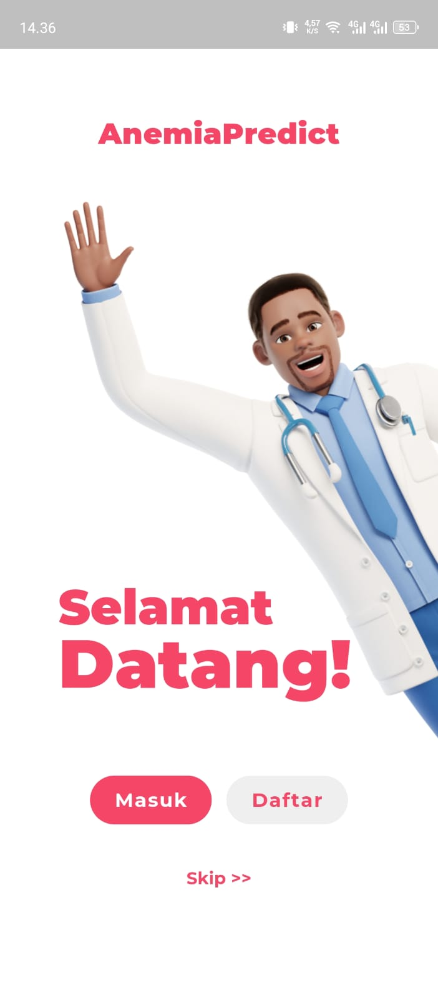
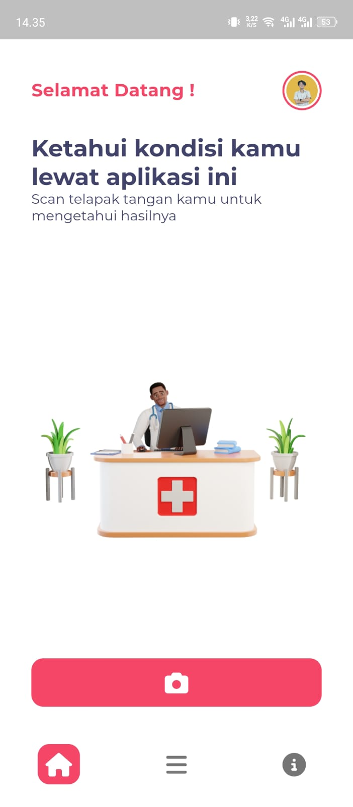
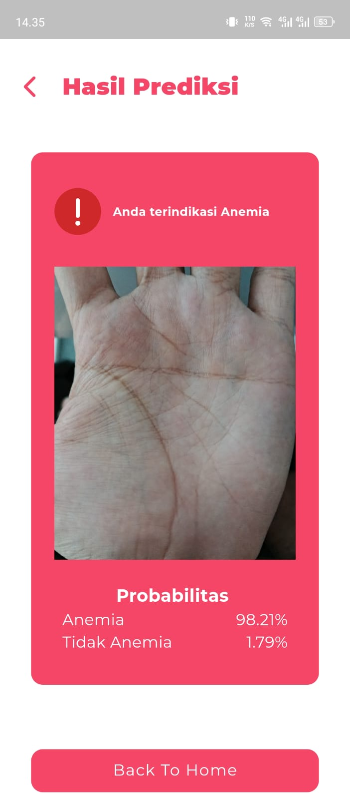

# Prediksi Anemia dari Citra Tangan (Flutter App)

## 📱 Deskripsi

Aplikasi mobile berbasis Flutter yang berfungsi sebagai **antarmuka pengguna** untuk melakukan **deteksi dini anemia** melalui **foto telapak tangan**. Gambar yang diambil dari aplikasi akan diunggah ke **API prediksi berbasis AI** yang berjalan di server terpisah. Proses prediksi dilakukan di sisi server menggunakan model Deep Learning, sehingga aplikasi ini berperan sebagai klien/front-end saja.

## ✨ Fitur Utama

* 🔍 **Prediksi Anemia** berdasarkan citra tangan pengguna (via API)
* 📷 **Pengambilan gambar langsung dari kamera**
* 🌐 **Koneksi ke API server** untuk prediksi
* 📀 Penyimpanan hasil prediksi lokal (opsional)
* 📲 Dukungan multi-platform (Android dan iOS)

## 📸 Cara Kerja Aplikasi

1. Pengguna mengambil gambar telapak tangan.
2. Gambar diunggah ke API server melalui endpoint HTTP.
3. Model AI di server menganalisis gambar dan mengirimkan hasil prediksi kembali ke aplikasi.
4. Hasil ditampilkan di layar beserta saran atau informasi medis singkat.

## 🚀 Cara Menjalankan Proyek

```bash
# Clone repository ini
git clone https://github.com/faeznz/mobile_anemia_predict_app.git
cd anemia-detector-app

# Jalankan pub get
flutter pub get

# Jalankan di emulator atau device
flutter run
```

## 🔒 Lisensi

Kode aplikasi ini dilisensikan dengan [MIT License](LICENSE).
Model AI dan dataset di server dilisensikan dengan [CC BY-NC 4.0 License](LICENSE-DATA) — hanya untuk penggunaan non-komersial.

## 🙌 Kontribusi

Kontribusi sangat terbuka! Kamu bisa bantu dengan:

* Membuat UI lebih menarik
* Menghubungkan aplikasi ke API lebih baik
* Menambahkan fitur baru yang interaktif

## 👨‍💻 Pengembang

* **Nama:** Zulfan Faizun
* **LinkedIn:** [linkedin.com/in/zulfanfaizunn](https://linkedin.com/in/zulfanfaizunn)
* **Email:** [faeznz@gmail.com](mailto:faeznz@gmail.com)

## 📷 Screenshot Aplikasi

<p align="center">
  
  
  
</p>